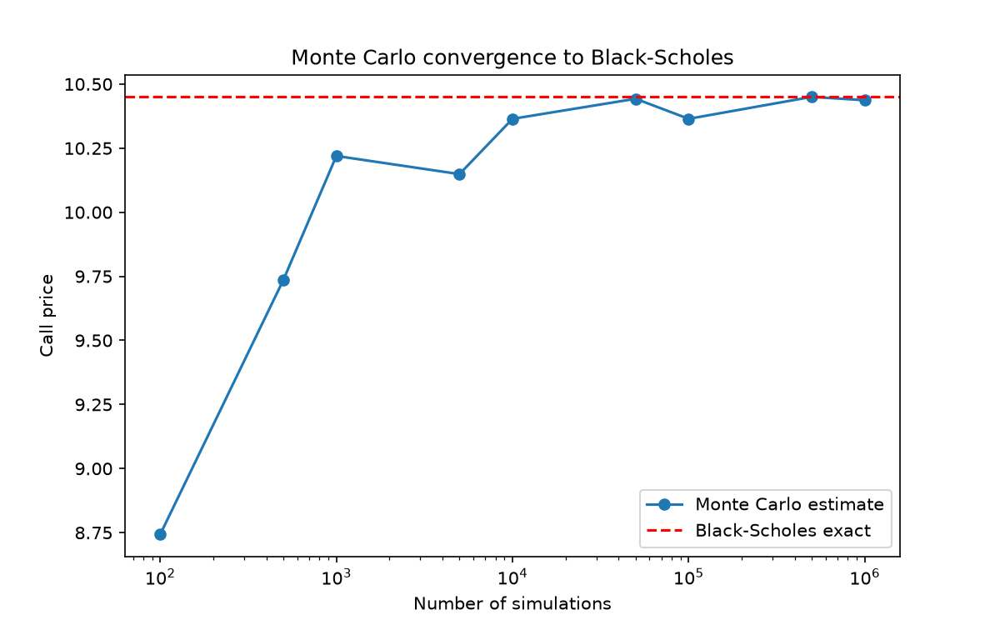
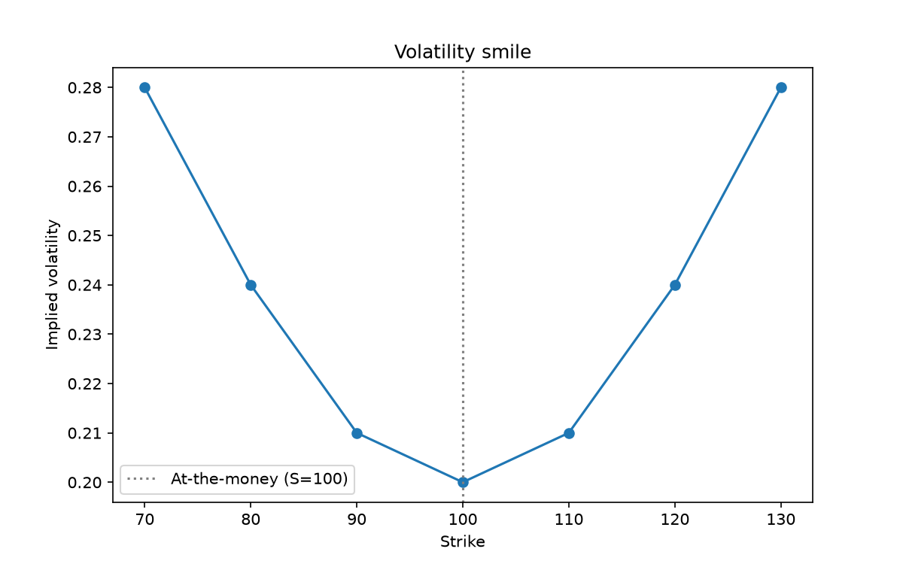

# Options Pricing Engine

A from-scratch options pricing engine in Python: Black-Scholes, Monte Carlo, Greeks and implied volatility - with no pricing libraries. Every pricing method is written from first principles and cross-validated against an independent method.

## What it does

**1. Black-Scholes (closed form)** - Prices European calls and puts using the analytic Black-Scholes formula. Verified via put-call parity.

**2. Monte Carlo** - Prices the same options by simulating terminal stock prices under geometric Brownian motion and averaging discounted payoffs. Convergence to the closed-form price is demonstrated below. 

**3. Greeks** - Computes delta, gamma, vega, theta and rho analytically, each validated against a central finite-difference approximation.

**4. Implied volatility** - Recovers implied volatility from market prices by root-finding (bisection and Newton-Raphson, the latter using vega as its derivative), and reconstructs the volatility smile across strikes. 

## Monte Carlo convergence


The Monte Carlo estimate converges to the closed-form Black-Scholes price as the number of simulations grows. Monte Carlo error scales as 1/√N, so quadrupling the number of simulations roughly halves the error.

## Volatility Smile


Implied volatility backed out per strike traces a smile rather than the flat line that constant-volatility Black-Scholes would predict. This reflects the market pricing in fatter tails and crash risk that the lognormal model ignores. (The smile shown is constructed for demonstration; the inversion method is identical to what would be applied to real market quotes.)

## Assumptions and limitations

This engine implements the standard Black-Scholes framework and inherits its assumptions: constant volatility, constant risk-free rate, no dividends, frictionless markets (no transaction costs), and European exercise only. The volatility smile above is itself evidence that the constant-volatility assumption does not hold in real markets. 

## Structure

- `black_scholes.py` - closed-form call and put pricers
- `monte_carlo.py` - Monte Carlo pricer under GBM
- `greeks.py` - analytic and finite-difference Greeks
- `implied_vol.py` - implied volatility solvers and the smile

## Running it

Requires `numpy`, `scipy`, and `matplotlib`. Each module runs standalone, e.g.:

```
python black_scholes.py
python greeks.py
python implied_vol.py
```